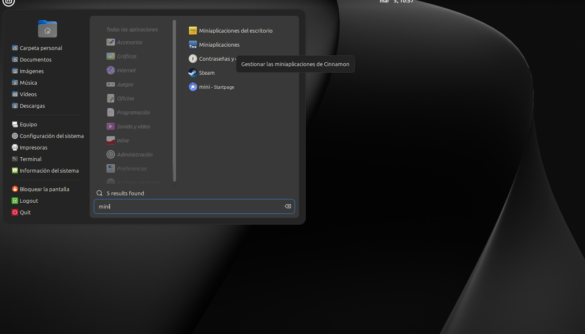
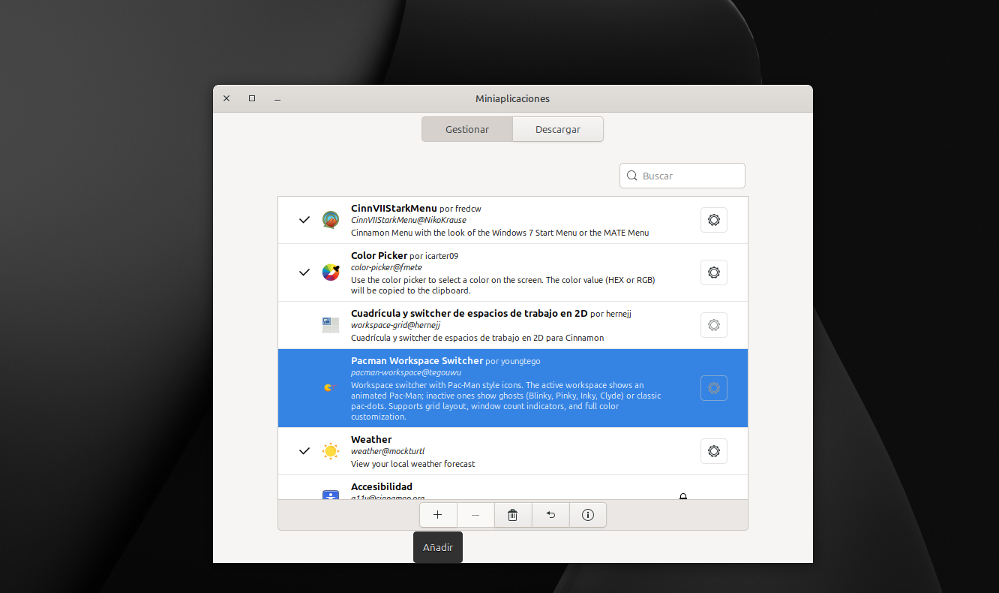
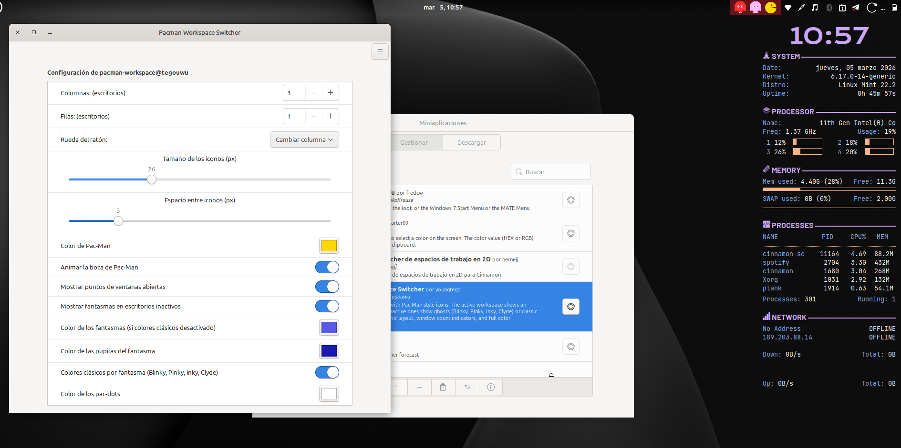
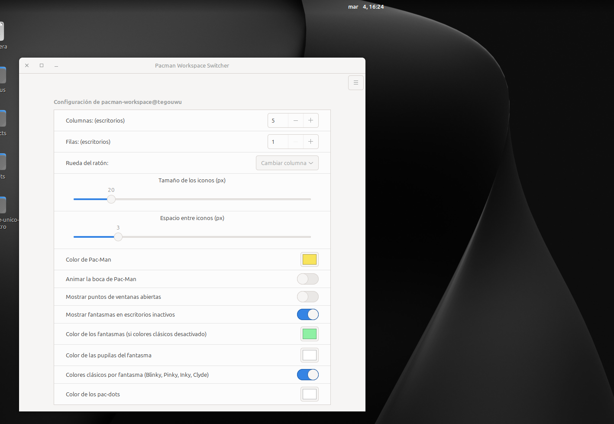
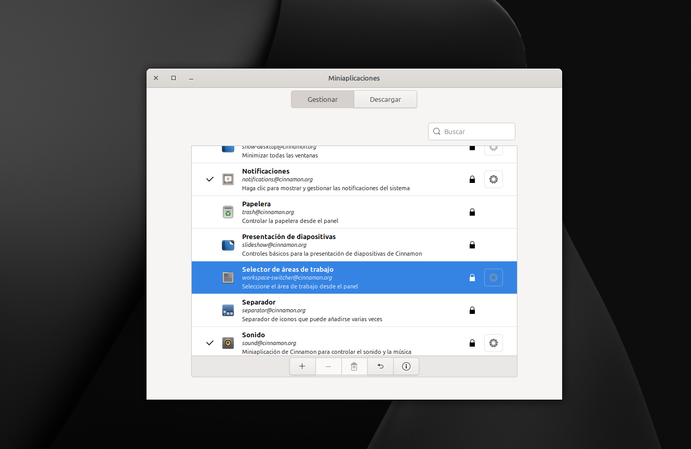

# Cambiador de Espacios de Trabajo Pacman

Un applet de panel de Cinnamon que reemplaza el cambiador de espacios de trabajo estándar con iconos temáticos de Pac-Man.

- El **espacio de trabajo activo** muestra un Pac-Man animado (la boca se abre y se cierra).
- Los **espacios de trabajo inactivos** muestran fantasmas clásicos: Blinky (rojo), Pinky (rosa), Inky (cián) y Clyde (naranja) — o pac-puntos si prefieres un aspecto más limpio.
- Pequeños **puntos de recuento de ventanas** aparecen debajo de cada icono de espacio de trabajo inactivo mostrando cuántas ventanas están abiertas allí.

## Características

- Boca de Pac-Man animada (se puede desactivar)
- Colores de fantasmas clásicos por fantasma (Blinky, Pinky, Inky, Clyde) o un color personalizado único
- Modo pac-punto opcional en lugar de fantasmas
- Puntos indicadores de recuento de ventanas (hasta 5)
- Cuadrícula configurable: columnas × filas
- Desplazamiento del ratón para cambiar espacios de trabajo (por columna o por fila)
- Personalización completa de colores: color de Pac-Man, color de fantasma, color de ojos del fantasma, color de pac-punto
- Controles de tamaño de icono y espaciado


### Instalacion
```bash
git clone https://github.com/TegoSavage/Arcade-Workspace-Switcher ~/.local/share/cinnamon/applets/pacman-workspace@tegouwu
```

## Manual
 una vez clonado el repositorio y movido la carpeta a  ```~/.local/share/cinnamon/applets/ ```
 sigue las instruccines de las imagenes



### En tu panel de aplicaciones busca ```miniaplicaciones```


Luego **Pacman Workspace Switchery y presiona el boton de +**.



## Configuración

Haz clic en el boton de → **Configurar...**





| Opción | Descripción |
|---------|-------------|
| Columnas / Filas | Tamaño de la cuadrícula (crea/elimina espacios de trabajo automáticamente) |
| Desplazamiento del ratón | Cambiar por columna o por fila |
| Tamaño de icono | 14–52 px |
| Espaciado | Espacio entre iconos |
| Animar Pac-Man | Activar/desactivar animación de la boca |
| Mostrar fantasmas | Alternar entre modo fantasma y modo pac-punto |
| Colores de fantasmas clásicos | Cada fantasma obtiene su color arcade de Pac-Man |
| Color de fantasma / Color de ojos | Colores personalizados cuando el modo clásico está desactivado |
| Color de pac-punto | Color de los puntos en modo pac-punto |
| Puntos de recuento de ventanas | Mostrar cuántas ventanas están abiertas por espacio de trabajo |


## Listo ya tiene el nuevo workpace de pacman en tu linux mint :)


**Si vez que tiene el de pacman y el por defecto de linux mint, puede desactivalo buscandolo como en la imagen y presionando la tecla -**




## Requisitos

- Cinnamon 4.6 o más reciente

## Aviso Legal

- Este proyecto está inspirado en la estética clásica de arcade.
Pac-Man es una marca registrada de Bandai Namco Entertainment.
Este proyecto no está afiliado ni respaldado por Bandai Namco.

## Licencia

- LICENCIA MIT
